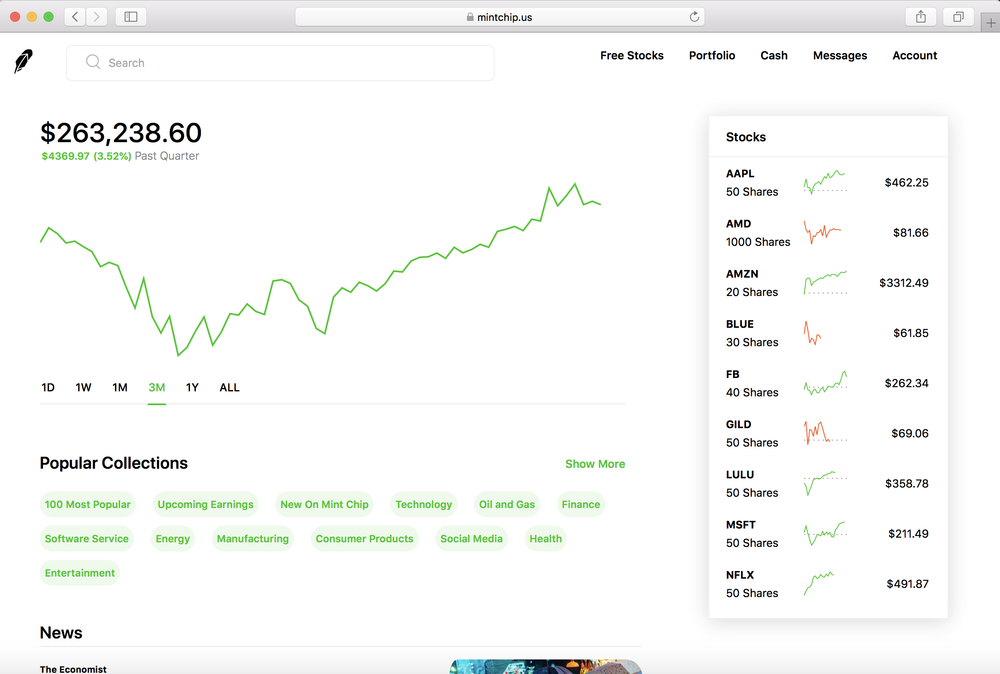

# mintchip

[www.mintchip.us](https://www.mintchip.us)

#### Mint Chip is a Robinhood Clone with real-time data and a demo cash account
Users can use this app to build and track hypothetical trades and stock holdings

**About**
- Full-Stack web application using Ruby on Rails with User Authentication, allowing users to buy and sell stocks with demo cash

- Functions as a stock portfolio tracker and one-stop-location for all stock news and information

- Ruby on Rails backend calculates portfolio balances, tracks individual stocks held, and processes stock sales

- REST APIs fetch portfolio/account data/stock holdings from the Rails backend for users to track a demo stock portfolio, complete with Daily, Weekly, Monthly, Yearly, and 5-Year graphs; 

- APIs also fetch up-to-date stock information, market news and real-time price data

**Technologies Used for Production and Deployment**
- Ruby on Rails 
- Active Record as ORM Framework
- React/Redux
- IEXCloud API
- NewsAPI.org
- RESTful APIs
- JQuery
- Jbuilder & JSON objects
- Javascript
- JSX
- HTML5
- CSS
- Herkoku, Git

**TO VIEW APP ON YOUR LOCALHOST**

After cloning, please follow these steps to get the app up and running:

In your terminal:
bundle exec rails db:setup
bundle exec rails db:seed
bundle install
npm install

To view in development mode, using bash, run:
rails s

In separate terminal, using node, run:
npm run start

