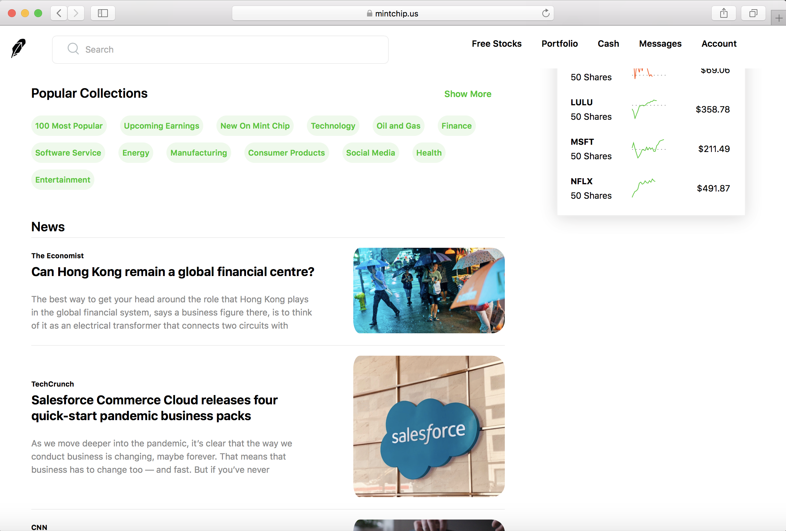
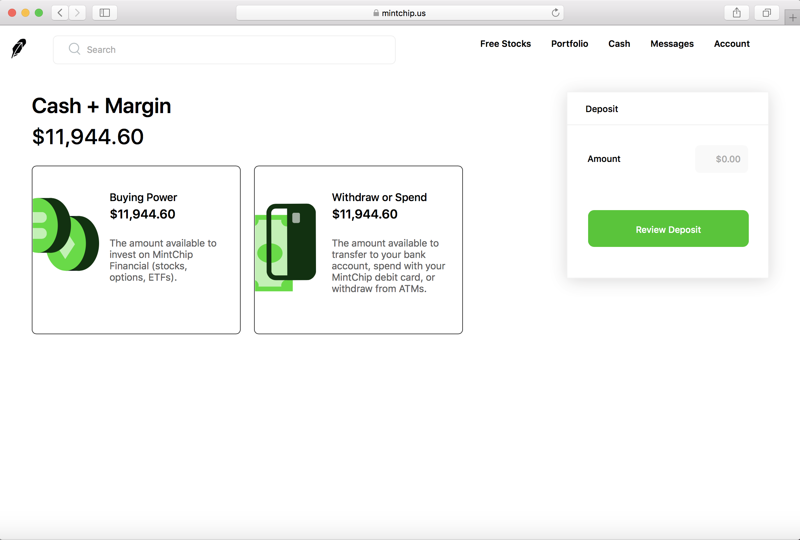
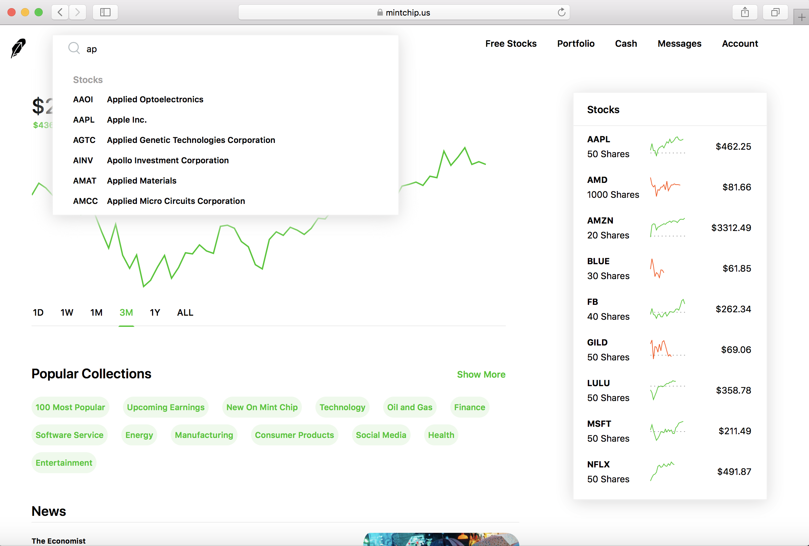

# mintchip
#### Mint Chip is a Robinhood Clone with real-time data and a demo cash account

[www.mintchip.us](https://www.mintchip.us)







Users can use this app to build and track hypothetical trades and stock holdings

**About**
- **Full-Stack** web application using **Ruby on Rails** with **User Authentication**, allowing users to buy and sell stocks with demo cash

- Functions as a stock portfolio tracker and one-stop-location for all stock news and information

- Ruby on Rails backend calculates portfolio balances, tracks individual stocks held, and processes stock sales

- **REST APIs** fetch portfolio/account data/stock holdings from the Rails backend for users to track a demo stock portfolio, complete with Daily, Weekly, Monthly, Yearly, and 5-Year graphs; 

- APIs also fetch up-to-date stock information, market news and real-time price data

**Technologies Used for Production and Deployment**
- Ruby on Rails 
- Active Record as ORM Framework
- React/Redux
- IEXCloud API
- NewsAPI.org
- RESTful APIs
- JQuery
- Jbuilder & JSON objects
- Javascript
- JSX
- HTML5
- CSS
- Herkoku, Git

## Coding Highlights 

### Ruby on Rails Backend

**@transactions** model records and saves each purchase and sale of stocks, including price, quantity, and total cost or gain.

This is used with the below code to calculate total stock value of the portfolio, and in turn, total portfolio value

For real-time, accurate date, stock price data is retreived from the IEXCloud API

``` ruby
def stocks_owned
      stocks = Hash.new(0)
      return [] if transactions.empty?
      transactions_with_stocks = transactions.includes(:stock)
  
      transactions_with_stocks.each do |transaction|
        curr_stock = transaction.stock
        if transaction.order_type == 'buy'
          stocks[curr_stock.ticker] += transaction.num_shares
        else
          stocks[curr_stock.ticker] -= transaction.num_shares
        end
      end
  
      stocks.reject { |_, shares| shares.zero? }
    end

    def calculate_stocks
      return [] if stocks_owned.empty?
  
      stocks = stocks_owned
                .map { |stock| {symbol: stock[0], shares: stock[1]} }
                .sort_by { |stock| stock[:symbol] }
  
      url = "https://cloud.iexapis.com/stable/stock/market/batch?types=quote,chart&range=1d&token=#{ENV["iex_api_key"]}&symbols="
      stocks.each { |stock| url += "#{stock[:symbol]},"}
      response = JSON.parse(open(url).read)
  
      #Credit to user245031 and lolmaus - Andrey Mikhaylov on Stack Overflow for the code to make API call in Ruby
      # response = JSON.parse(open(url).read)
      stocks.each_with_index do |stock, idx|
        price = response[stock[:symbol]]['quote']['latestPrice'].to_f.round(2).to_s
        if !price.include?('.')
          price += '.00'
        elsif price.split('.')[1].length == 1
          price += '0'
        end
        stock[:price] = price
        stock[:intradayData] = response[stock[:symbol]]['chart']
        stock[:openPrice] = stock[:intradayData][0]['open']
      end
  
      stocks
    end
  
    
  def calculate_balance
    stocks = calculate_stocks
    balance = calculate_buying_power
    stocks.each do |stock|
      balance += (stock[:price].to_f * stock[:shares])
    end
    
   sprintf('%.2f', balance.round(2))
  end
```

Portfolio "Snapshots" are taken once daily, and this allows historical portolio data to be charted and accounted for.

### Frontend

Depending on the state (whether '1D', '1W', '1M', '3M', '1Y', or '5Y' is selected), the frontend chart component collects the corresponding data (calculated in the backend) and feeds it to the LineChart:

```
     if (this.state.active === '3M' && currentUser && currentUser.hasOwnProperty('balance_data')) {
                    let balanceData
                    balanceData = currentUser.balance_data
                    
                    for (let i = balanceData.length-67; i < balanceData.length - 1; i++){
                       
                        main.push({
                            time: `${balanceData[i].time}`,
                            price: `${balanceData[i].balance}`}) 
                        prices.push(`${balanceData[i].balance}`)
                        
                    
                    }
                marginRight = 30
                today = "Past Quarter" }

```

```
<LineChart width={700} height={220} data={main} margin={{ top: 5, right: 30, left: 0 bottom: 10 }}>
    <YAxis
    hide={true}
    domain={[min, max]}
    />
    <ReferenceLine y={previousClose} stroke="gray" strokeWidth={1} strokeDasharray="1.5 6"/>
    <Line type="linear" dataKey="price" dot={false} stroke={change > 0 ? "rgba(0,200,5,1)" : "rgba(255,80,0,1)"} strokeWidth={2}/>
</LineChart>
```
**Other Features**

Users can search for stocks in the search bar.  Stock names and tickers are seeded into the database from the NYSE and Nasdaq.  API calls use this information to get the corresponding data for each stock when selected.

Colors will be green when the time period selected (per state) is positive (so the portfolio change or stock change for time period selected is positive) or red for negative.  This makes for easy and clear UX.

**TO VIEW APP ON YOUR LOCALHOST**

After cloning, please follow these steps to get the app up and running:

In your terminal:
bundle exec rails db:setup
bundle exec rails db:seed
bundle install
npm install

To view in development mode, using bash, run:
rails s

In separate terminal, using node, run:
npm run start

**To Be Completed**

Fix daily data for portfolio chart (currently not rendering)

Add Watchlist Feature (to watch selected stocks in sidebar)

Create Free Stocks Page, and Message Section for clients to communicate with MintChip

Create collections page, where stocks can be viewed based upon the collection to which they belong